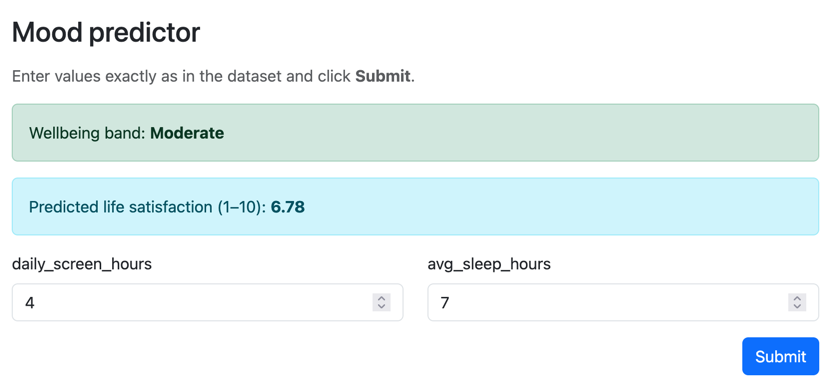

A simple **feed-forward neural network** built from scratch with the task of predicting a mental health state based on behavioural data input (`screen time hours` and `sleeping hours`).

This project developed as part of the "Foundations of Machine Learning" seminar at Universität Osnabrück.

### Objective
Two independent models predict 
- a mood score (`good`, `moderate`, `at-risk`) as a classification task
- life satisfaction on a scale from 1 to 10 as a regression task
### Implementation
Forward propagation, loss computation, backpropagation, regularization, and gradient-descent updates were implemented with *NumPy* rather than a neural-network framework. *Scikit-learn* provide non-model utilities such as preprocessing, splitting, and metric reporting. *Matplotlib* was used for the learning curves.
### Dataset
We used the Kaggle dataset [*Social Media, Screen Time & Mental Health 2026*](https://www.kaggle.com/datasets/uditjain13/social-media-screen-time-and-mental-health-2026). A simulated wellbeing survey of 7,000 people linking daily screen time and platform habits to anxiety, sleep, mood, and life satisfaction. The dataset contains 25 columns covering demographics, usage behaviour, and self-reported wellbeing proxies. Because all rows are synthetic and programmatically generated, the project can test implementation and experimental reasoning but cannot establish clinical or causal relationships.
### Start here
- *mood-predictor.ipynb* contains the models
- *ui/app.py* contains a self-hostable app with a simple interface to make predictions based on our final trained model:
  

